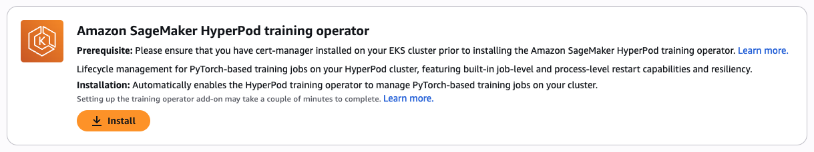
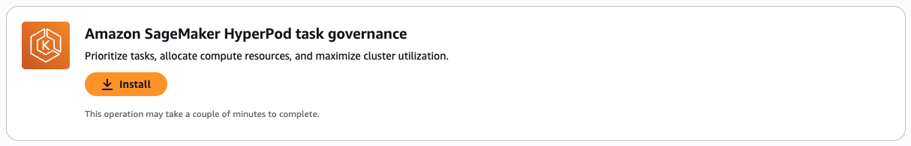
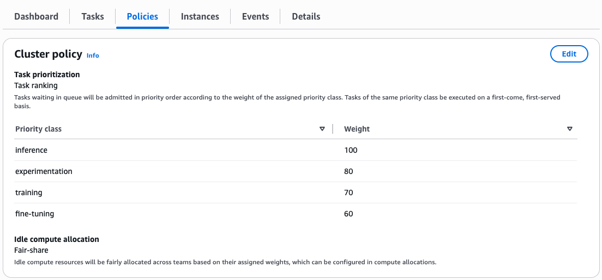
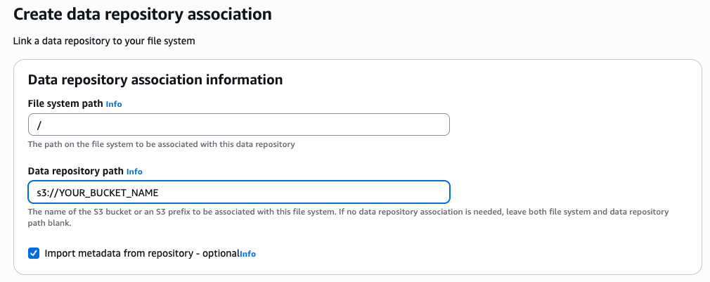
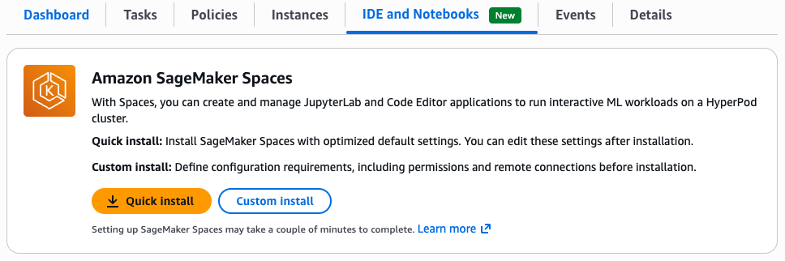
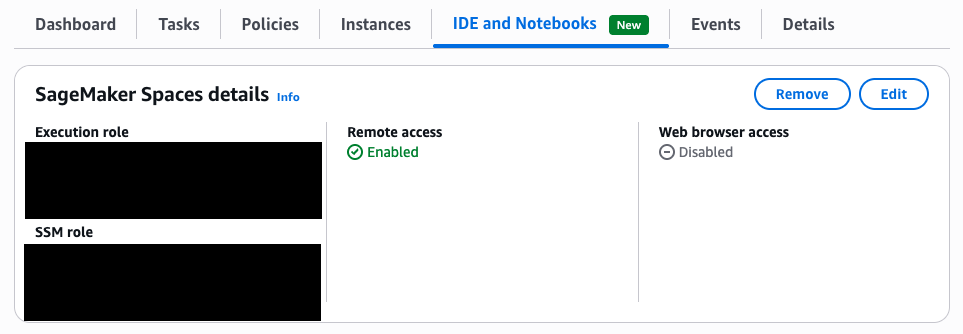

# Getting Started - HyperPod CLI End-to-End Walkthrough

This page walks you through the configuration of your HyperPod cluster and ensures that it supports all examples in this walkthrough.

## Prerequisites

This end-to-end example assumes a HyperPod cluster setup in your AWS account. This can be done through the AWS console UI. Setup instructions can be found in the [AWS Documentation](https://docs.aws.amazon.com/sagemaker/latest/dg/sagemaker-hyperpod-eks-operate-console-ui-create-cluster.html). Alternatively, [01-(optional)-cluster-creation.md](./01-(optional)-cluster-creation.md) contains instructions on how to create a new HyperPod cluster using the CLI features. In both cases, the cluster should have the following minimum specifications to run the above examples. Please ensure that you have the required service quota available:
- General compute instance group with CPU-based nodes for operator pods
    - Recommended instances: 2 `ml.t3.2xlarge` instances 
- GPU worker instance group for worker pods
    - Recommended instances: 3 `ml.g5.12xlarge` instances.
- FSx for Lustre filesystem linked to the cluster. The examples only consume very little storage, thus the minimum FSx filesystem size of `1.200 GB` is sufficient.
- HyperPod Inference Operator installation. This is automatically toggled at cluster creation time. For manual instructions please check the corresponding [AWS documentation](https://docs.aws.amazon.com/sagemaker/latest/dg/sagemaker-hyperpod-model-deployment-setup.html).

Please ensure you have the following tools available in your local environment to be able to execute the examples.
- A local terminal with access to `python` version `>=3.10`.
- [`aws`](https://docs.aws.amazon.com/cli/latest/userguide/getting-started-install.html) CLI version `>=2`
- [`kubectl`](https://kubernetes.io/docs/tasks/tools/) compatible to your EKS cluster k8s version

## Installing the SageMaker HyperPod CLI

You can install the SageMaker HyperPod CLI package from PyPi using `pip`. We recommended creating a clean virtual environment before installing the package.

```bash
# Optional: Create a new virtual environment in the current directory and activate it
python -m venv .venv
source .venv/bin/activate

# Install the CLI package
pip install sagemaker-hyperpod
```
This will make the HyperPod CLI available through the `hyp` command in your terminal.
Additionally, the Python SDK can be imported as `sagemaker.hyperpod`.
You can show the available commands and verify that the installation completed successfully by 
running the following:
```bash
hyp --help 
```

Show the current CLI version and template versions.
```bash
hyp --version
```

### Connecting to an existing cluster

List your existing cluster(s) by running the following command. The `--region` flag is optional, if it is not provided, the default region of your `aws` CLI configuration will be used.
```bash
hyp list-cluster --region <region-name>
```

This will show you an output, similar to the following if you already have an existing cluster:
```bash
[
    {
        "Cluster": "hp-eks-test-cluster",
        "Instances": [
            {
                "InstanceType": "ml.t3.xlarge",
                "TotalNodes": 2,
                "AcceleratorDevicesAvailable": "N/A",
                "NodeHealthStatus=Schedulable": 2,
                "DeepHealthCheckStatus=Passed": "N/A"
            },
            {
                "InstanceType": "ml.g5.12xlarge",
                "TotalNodes": 2,
                "AcceleratorDevicesAvailable": 8,
                "NodeHealthStatus=Schedulable": 2,
                "DeepHealthCheckStatus=Passed": "N/A"
            }
        ]
    },
]
```

Set the cluster context to a specific cluster to be used with other CLI commands, e.g. for submitting training jobs:
```bash
hyp set-cluster-context --cluster-name <cluster-name> --region <region-name>
``` 

The above command modifies your `.kube/config`. Thus this cluster context will also be used
by general kubernetes tools such as `kubectl` and `k9s`.

You can retrieve the current cluster context by running:
```bash
hyp get-cluster-context
```

## Installing required HyperPod Add-ons

For the examples in this repository, three Hyperpod add-ons are required: (1) HyperPod Training Operator, (2) HyperPod Task Governance and (3) SageMaker Spaces.

### HyperPod Training Operator

The HyperPod training operator helps you accelerate generative AI model development by efficiently managing distributed training across large GPU clusters. The easiest way to install the training operator is through the HyperPod cluster UI in the AWS console:
- Navigate to your HyperPod cluster in the SageMaker part of the AWS console
- In the Dashboard, scroll down to find the Amazon SageMaker HyperPod training operator installation option
- Click on **Install**



Alternatively, the training operator add-on can be installed via the AWS CLI. Further information on the setup can be found in the corresponding [AWS documentation](https://docs.aws.amazon.com/sagemaker/latest/dg/sagemaker-eks-operator-install.html).

The training operator does not require additional configuration.

### HyperPod Task Governance

SageMaker HyperPod task governance is a robust management system designed to streamline resource allocation and ensure efficient utilization of compute resources across teams and projects for your Amazon EKS clusters. This provides administrators with the capability to set:
- Priority levels for various tasks
- Compute allocation for each team
- How each team lends and borrows idle compute
- If a team can preempt their own tasks

The task governance utilizes `kueue` to implement these functionalities. 

#### Installation
The easiest way to install the task governance add-on is through the HyperPod cluster UI in the AWS console:
- Navigate to your HyperPod cluster in the SageMaker part of the AWS console
- In the Dashboard, scroll down to find the Amazon SageMaker HyperPod Task Governance installation option
- Click on **Install**



Alternatively, the task governance add-on can be installed via the AWS CLI. Further information on the setup can be found in the corresponding [AWS documentation](https://docs.aws.amazon.com/sagemaker/latest/dg/sagemaker-hyperpod-eks-operate-console-ui-governance.html).

#### Configuration
For the examples in this repository, we need to configure two aspects of task governance: **(1) Cluster scheduler policy** and **(2) Team compute allocations**. Lastly, we need to adjust the FSx filesystem access accordingly.
While both can be configured through the AWS console, in the "Policies" tab of your HyperPod cluster, we will configure them through CLI commands for easy reproducability.

Setup the required environment variable
```bash
HYPERPOD_CLUSTER_ARN=$(aws sagemaker list-clusters --name-contains <cluster-name> | jq -r '.ClusterSummaries[0].ClusterArn')
```

**Cluster Scheduler Policy**

To update how tasks are prioritized and how idle compute is allocated, apply a Cluster Scheduler Policy using the following configuration:
```bash
aws sagemaker \
    create-cluster-scheduler-config \
    --name "example-cluster-scheduler-config" \
    --cluster-arn $HYPERPOD_CLUSTER_ARN \
    --scheduler-config "PriorityClasses=[{Name=inference,Weight=90},{Name=experimentation,Weight=80},{Name=fine-tuning,Weight=50},{Name=training,Weight=70}],FairShare=Enabled"
```
To verify creation, run:
```bash
aws sagemaker list-cluster-scheduler-configs --name-contains example-cluster-scheduler-config
```
You should see `Status: Created`.
Sometimes if we try to create the Scheduler Config before Task Governance is completely installed, it will lead to `CreateFailed`. To resolve, delete the scheduler config. After deleting, please recreate the policy using the aforementioned command.
```bash
SCHEDULER_CONFIG_ID=$(aws sagemaker list-cluster-scheduler-configs --name-contains example-cluster-scheduler-config | jq -r '.ClusterSchedulerConfigSummaries[0].ClusterSchedulerConfigId')

aws sagemaker delete-cluster-scheduler-config --cluster-scheduler-config-id $SCHEDULER_CONFIG_ID
```

This CLI command will output two values: `CreateSchedulerConfigArn` and `ClusterSchedulerConfigId`. This will generate a cluster policy with fair sharing enabled and the following priority classes, which can be viewed by navigating to your HyperPod cluster in the SageMaker part of the AWS console and selecting the tab **"Policies"**:



**Team compute allocations**

Each team requires a Compute Allocation to manage their compute capacity. Both teams will have 1 instances allocated, 0 fair-share weight, and 100% borrowing capability. Please adapt the `InstanceType` accordingly if you are using different instance types.

```bash
aws sagemaker \
    create-compute-quota \
    --name "Team-A" \
    --cluster-arn $HYPERPOD_CLUSTER_ARN \
    --compute-quota-config "ComputeQuotaResources=[{InstanceType=ml.g5.12xlarge,Count=1}],ResourceSharingConfig={Strategy=LendAndBorrow,BorrowLimit=100},PreemptTeamTasks=LowerPriority" \
    --activation-state "Enabled" \
    --compute-quota-target "TeamName=team-a,FairShareWeight=0"
```

```bash
aws sagemaker \
    create-compute-quota \
    --name "Team-B" \
    --cluster-arn $HYPERPOD_CLUSTER_ARN \
    --compute-quota-config "ComputeQuotaResources=[{InstanceType=ml.g5.12xlarge,Count=1}],ResourceSharingConfig={Strategy=LendAndBorrow,BorrowLimit=100},PreemptTeamTasks=LowerPriority" \
    --activation-state "Enabled" \
    --compute-quota-target "TeamName=team-b,FairShareWeight=0"
```

This will create the team-specific compute quotas as well as the corresponding Kubernetes namespaces in the cluster with the HyperPod naming scheme. In this example, `hyperpod-ns-team-a` and `hyperpod-ns-team-b` are created. This can again be viewed in the **"Policies"** tab of your HyperPod cluster in the AWS console:


#### Disable `kueue` Topology Aware Scheduling (TAS)

Currently, the task preemption functionality of Task Governance is incompatible with `kueue`'s Topology Aware Scheduling (TAS) feature. Thus, we need to disable it before continuing. This can be done by:
To disable topology aware scheduling in Kueue, you have to edit the Kueue configuration.

Open the `kueue` config map:
```bash
kubectl edit configmap kueue-manager-config -n kueue-system
```
This will per default open `vim` as editor.
Set `featureGates: TopologyAwareScheduling` to `false`:

```yaml
apiVersion: v1
kind: ConfigMap
metadata:
  name: kueue-manager-config
  namespace: kueue-system
data:
  controller_manager_config.yaml: |
    ... scroll down ...
    resources:
      excludeResourcePrefixes:
      - vpc.amazonaws.com/efa
    featureGates:
      TopologyAwareScheduling: false
```
Close and save the config by typing `:wq!`.

After saving, restart the Kueue controller:

```bash
kubectl rollout restart deployment kueue-controller-manager -n kueue-system
```

#### FSx for Lustre Configuration

In this section you will link your cluster's FSx for Lustre filesystem to an S3 bucket via Data Repository Association and enable the newly created Task Governance team namespaces to access the filesytem.

**Setting up the Data Repository Association (DRA)**

While the FSx filesystem is typically created automatically at cluster creation as described in the [AWS Documentation](https://docs.aws.amazon.com/sagemaker/latest/dg/sagemaker-hyperpod-eks-operate-console-ui-create-cluster.html), we need to additionally link it to an S3 bucket so we can easily transfer the training data and scripts to it. This is done through FSx Data Repository Association (DRA), more information is available in the [AWS Documentation](https://docs.aws.amazon.com/fsx/latest/LustreGuide/create-dra-linked-data-repo.html).

For this, you will need an S3 bucket that will be synced with your FSx for Lustre filesystem. This can be an existing bucket or a newly created one. Once you have selected an S3 bucket, navigate to your FSx filesystem in the AWS console and select the **Data Repository** tab. Consequently click on **Create data repository association**.


In the following form, enter the name of your S3 bucket in **Data repository path** and choose the root path as the **File system path**. All other options can be left with their defaults. Finally, click on **Create**. The DRA will take a few minutes to get created and you can monitor the status in the AWS console on your FSx filesystem's page.



**Making FSx available to Task Governance namespaces**

The cluster creation workflow will automatically make the FSx filesystem available as a `PersistentVolumeClaim` in the clusters `default` namespace. To run the team-specific examples, we need to make it available to the newly created namespaces as well.

Retrieve the details of your current FSx Fileystem by navigating to Amazon FSx in the AWS console and clicking on the FSx for Lustre filesystem belonging to your HyperPod cluster. Then, setup the following environment variables with the respective values:
```bash
export FSX_FILESYSTEM_ID="PLEASE_FILL_IN"
export FSX_DNS_NAME="PLEASE_FILL_IN"
export FSX_MOUNT_NAME="PLEASE_FILL_IN"
export FSX_CAPACITY_GIB="1200" # Change if required

export TEAM_A_NAMESPACE="hyperpod-ns-team-a"
export TEAM_B_NAMESPACE="hyperpod-ns-team-b"
```

Use `envsubst` to replace the placeholders in the provided template with your environment variables:
```bash
envsubst < ./00-getting-started/kubernetes/fsx-task-governance-template.yaml > fsx-pv-pvc.yaml
```

Apply the manifest to your cluster:
```bash
kubectl apply -f fsx-pv-pvc.yaml
```

This will create both `PersistentVolumes` and `PersistenVolumeClaims` to your FSx filesystem in the newly created namespaces.


### SageMaker Spaces
SageMaker Spaces allows AI developers to run their interactive machine learning workloads directly on the HyperPod EKS cluster through IDEs and notebooks.

The easiest way to install the Spaces add-on is through the HyperPod cluster UI in the AWS console:
- Navigate to your HyperPod cluster in the SageMaker part of the AWS console
- In the Dashboard of your HyperPod cluster, select the **IDE and Notebooks** tab.
- Click on **Quick Install**



The installation will take a few minutes. After successfull installation, you can see the status in the console UI:


No further setup is required at this point, the actual code editor space will be set up in the example [04-spaces/00-create-code-editor-space.md](../04-spaces/00-create-code-editor-space.md). 

Further information on the setup and usage of SageMaker spaces on HyperPod can be found in the corresponding [AWS documentation](https://docs.aws.amazon.com/sagemaker/latest/dg/sagemaker-hyperpod-eks-cluster-ide.html).