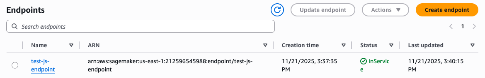
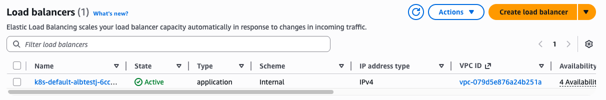

# Deploying a model from SageMaker JumpStart for Inference - HyperPod CLI End-to-End Walkthrough

This example shows how to deploy an **open-weights LLM from SageMaker JumpStart** for inference on your HyperPod Cluster.

In the following you will:
- Deploy a DeepSeek LLM model for inference
- Monitor and manage the endpoint deployment
- Test the endpoint with sample requests
- Clean up resources when finished

This example assumes that you completed the setup instructions in [00-getting-started/00-setup.md](../00-getting-started/00-setup.md).

## Deploy the JumpStart Endpoint (💻)

Check the available command options for creating a JumpStart endpoint:
```bash
hyp create hyp-jumpstart-endpoint --help
```

Set up environment variables for the deployment. Please replace the `S3_CERT_URI` with an S3 bucket URI that your cluster inference operator role can access. If you used the console UI to create the cluster, the inference operator role and a corresponding bucket will be created automatically and the bucket will be named `sagemaker-HP_CLUSTER_NAME-RANDOMID-tls-RANDOMID`.

```bash
# Please use the S3 URI, including the prefix s3://
S3_CERT_URI="s3://PLEASE_FILL_IN"

ENDPOINT_NAME="test-js-endpoint"
MODEL_ID="deepseek-llm-r1-distill-qwen-1-5b"
```

(Optional) Attempt to create an endpoint with an instance type that is incompatible with the JumpStart model to see the validation features of the HyperPod CLI:
```bash
hyp create hyp-jumpstart-endpoint \
  --model-id $MODEL_ID \
  --instance-type ml.t3.xlarge \
  --endpoint-name $ENDPOINT_NAME \
  --tls-certificate-output-s3-uri $S3_CERT_URI \
  --namespace default
```

Create the endpoint with a properly sized and available instance type:
```bash
hyp create hyp-jumpstart-endpoint \
  --model-id $MODEL_ID \
  --instance-type ml.g5.12xlarge \
  --endpoint-name $ENDPOINT_NAME \
  --tls-certificate-output-s3-uri $S3_CERT_URI \
  --namespace default
```

## Monitor the Endpoint Deployment (💻)

List all JumpStart endpoints and check their status:
```bash
hyp list hyp-jumpstart-endpoint
```

Check the inference operator logs to see the deployment progress
and check for any potential issues.
```bash
hyp get-operator-logs hyp-custom-endpoint --since-hours 1
```

Get detailed information about the specific endpoint:
```bash
hyp describe hyp-jumpstart-endpoint --name $ENDPOINT_NAME
```

List the pods associated with the endpoint:
```bash
hyp list-pods hyp-jumpstart-endpoint --endpoint-name $ENDPOINT_NAME
```

Check the logs for a specific pod (replace with actual pod name):
```bash
POD_NAME="test-js-endpoint-76588dc9-tzf89"

hyp get-logs hyp-jumpstart-endpoint --pod-name $POD_NAME
```

You can additionally view both the Application Load Balancer and SageMaker Inference Endpoint creation in the AWS console
by navigating to:
- Amazon SageMaker AI -> Deployments & Inference -> Endpoints
- Amazon EC2 -> Load Balancing -> Load Balancers




## Test the Endpoint (💻)

Once the endpoint is running, test it with a sample inference request:
```bash
hyp invoke hyp-jumpstart-endpoint \
    --endpoint-name $ENDPOINT_NAME \
    --body '{
        "messages": [
            {
                "role": "system",
                "content": "You are a helpful AI assistant that can answer questions and provide information. Give brief answers."
            },
            {
                "role": "user",
                "content": "What is the capital of USA?"
            }
        ],
        "temperature": 0.1,
        "top_p": 0.95,
        "max_tokens": 512
    }'
```

When you're finished with the endpoint, delete the endpoint to free up the resources:
```
hyp delete hyp-jumpstart-endpoint --name $ENDPOINT_NAME
```

## (Optional) Deploy the model by creating a customizable template
Alternatively to creating a JumpStart model deployment via the `hyp create hyp-jumpstart-endpoint` command
above, the HyperPod CLI also enables a configuration file-based workflow that allows
for easy reproducability as well as further customization options as the Kubernetes
template is directly exposed to the user.

Initialize a JumpStart model deployment configuration in a new directory by running:
```bash
mkdir jumpstart-model-config && cd jumpstart-model-config

hyp init hyp-jumpstart-endpoint
```

This will create three files in the new directory:
- `k8s.jinja` - Kubernetes template for a `JumpStartModel` resource
- `config.yaml` - Configuration file that contains the values for the Kubernetes template
- `README.md` - Usage instructions for this functionality

The configuration parameters can be either modified directly in the `config.yaml` or via 
the CLI by executing `hyp configure --<parameter-name> <parameter-value>` which provides
additional validation.

To reproduce the earlier JumpStart CLI example, run the following commands:
```
hyp configure --endpoint-name $ENDPOINT_NAME
hyp configure --model-id $MODEL_ID
hyp configure --tls-certificate-output-s3-uri $S3_CERT_URI
hyp configure --instance-type ml.g5.12xlarge
```

Validate the values in `config.yaml` by running:
```bash
hyp validate
```

Submit the JumpStart deployment to the cluster by running:
```bash
hyp create
```

The final, submitted Kubernetes manifest will be stored for reference in `./run/<timestamp>/k8s.yaml`.
You can consequently test the endpoint invokation in the same way as the one created in the previous example.

When you're finished with the endpoint, delete the endpoint to free up the resources:
```
hyp delete hyp-jumpstart-endpoint --name $ENDPOINT_NAME
```