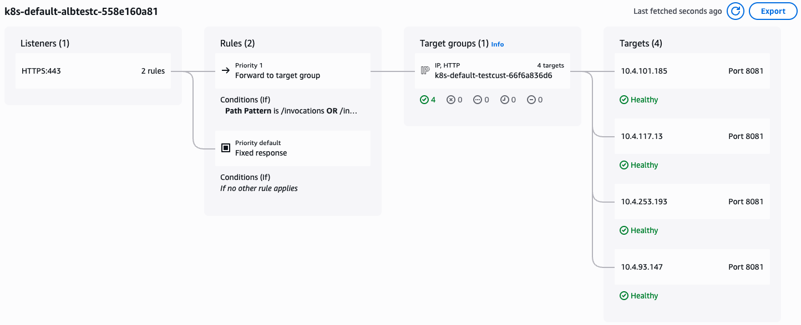

# Deploying a custom model for Inference - HyperPod CLI End-to-End Walkthrough

This example shows how to deploy a **custom LLM with weights stored on S3** for inference on your HyperPod Cluster.

In the following you will:
- Deploy a TinyLlama model for inference
- Monitor and manage the endpoint deployment
- Test the endpoint with sample requests
- Clean up resources when finished

This example assumes that you completed the setup instructions in [00-getting-started/00-setup.md](../00-getting-started/00-setup.md).

While this example shows the workflow for deploying a model that is stored on S3,
the workflow is equivalent to a model stored in FSx. More information is available in the corresponding [AWS documentation](https://docs.aws.amazon.com/sagemaker/latest/dg/sagemaker-hyperpod-model-deployment-deploy-ftm.html).

## Prepare a model for deployment

For this example, you are going to deploy a TinyLlama 1.1B Chat v1.0
model for inference on your HyperPod cluster.

First, setup the environment variables and download the model checkpoint from Hugginface. Then, transfer it to an S3 bucket. Please replace the variables `S3_MODEL_BUCKET_NAME`, `S3_CERT_URI` and `S3_MODEL_REGION` with an S3 bucket that your cluster inference operator role can access. If you used the console UI to create the cluster, the inference operator role and a corresponding bucket will be created automatically and the bucket will be named `sagemaker-HP_CLUSTER_NAME-RANDOMID-tls-RANDOMID`.
```bash
S3_MODEL_BUCKET_NAME="PLEASE_FILL_IN"
S3_MODEL_REGION="PLEASE_FILL_IN"

S3_CERT_URI="s3://PLEASE_FILL_IN"

INSTANCE_TYPE=ml.g5.12xlarge

MODEL_NAME="tinyllama"
HF_MODEL_ID="TinyLlama/TinyLlama-1.1B-Chat-v1.0"
CHECKPOINT_DIR="tinyllama-1.1b-chat"
S3_MODEL_URI="s3://$S3_MODEL_BUCKET_NAME/$CHECKPOINT_DIR"
ENDPOINT_NAME="test-custom-endpoint"

pip install huggingface-hub

hf download $HF_MODEL_ID --local-dir $CHECKPOINT_DIR

aws s3 sync $CHECKPOINT_DIR $S3_MODEL_URI
```

## Deploy the custom model (💻)

Check the available command options for creating a custom model endpoint:
```bash
hyp create hyp-custom-endpoint --help
```

Create the endpoint:
```
hyp create hyp-custom-endpoint \
    --endpoint-name $ENDPOINT_NAME \
    --model-name $MODEL_NAME \
    --model-source-type s3 \
    --s3-bucket-name $S3_MODEL_BUCKET_NAME \
    --s3-region $S3_MODEL_REGION \
    --model-location $CHECKPOINT_DIR \
    --instance-type $INSTANCE_TYPE \
    --image-uri 763104351884.dkr.ecr.us-west-2.amazonaws.com/djl-inference:0.33.0-lmi15.0.0-cu128 \
    --container-port 8080 \
    --model-volume-mount-name modelmount \
    --tls-certificate-output-s3-uri $S3_CERT_URI \
    --namespace default
```

## Monitor the Endpoint Deployment (💻)

List all custom endpoints and check their status:
```bash
hyp list hyp-custom-endpoint
```

Check the inference operator logs to see the deployment progress
and check for any potential issues.
```bash
hyp get-operator-logs hyp-custom-endpoint --since-hours 0.5
```

Get detailed information about the specific endpoint:
```bash
hyp describe hyp-custom-endpoint --name $ENDPOINT_NAME
```

List the pods associated with the endpoint:
```bash
hyp list-pods hyp-custom-endpoint --endpoint-name $ENDPOINT_NAME
```

Check the logs for a specific pod (replace with actual pod name):
```bash
POD_NAME="test-custom-endpoint-76588dc9-tzf89"

hyp get-logs hyp-custom-endpoint --pod-name $POD_NAME
```

## Test the Endpoint (💻)

Once the endpoint is running, test it with a sample inference request:
```bash
hyp invoke hyp-custom-endpoint \
    --endpoint-name $ENDPOINT_NAME \
    --body '{
        "messages": [
            {
                "role": "system",
                "content": "You are a helpful AI assistant that can answer questions and provide information. Give brief answers."
            },
            {
                "role": "user",
                "content": "What is the capital of USA?"
            }
        ],
        "temperature": 0.1,
        "top_p": 0.95,
        "max_tokens": 512
    }'
```

When you're finished with the endpoint, delete the endpoint to free up the resources:
```
hyp delete hyp-custom-endpoint --name $ENDPOINT_NAME
```

## (Optional) Deploy the model by creating a customizable template and setup autoscaling (💻)
Alternatively to creating a custom model deployment via the `hyp create hyp-custom-endpoint` command
above, the HyperPod CLI also enables a configuration file-based workflow that allows
for easy reproducability as well as further customization options as the Kubernetes
template is directly exposed to the user.

Initialize a custom model deployment configuration in a new directory by running:
```bash
mkdir custom-model-config && cd custom-model-config

hyp init hyp-custom-endpoint
```

This will create three files in the new directory:
- `k8s.jinja` - Kubernetes template for a `InferenceEndpointConfig` resource
- `config.yaml` - Configuration file that contains the values for the Kubernetes template
- `README.md` - Usage instructions for this functionality

The configuration parameters can be either modified directly in the `config.yaml` or via 
the CLI by executing `hyp configure --<parameter-name> <parameter-value>` which provides
additional validation.

With the following commands, you can deploy the same model as in the previous example, with an additional autoscaling configuration that will automatically scale the model to multiple pods, according to the number of requests to the SageMaker endpoint. The number of requests is logged to and accessed through CloudWatch.

In the next example, you will trigger this scaling functionality to see it in action. A detailed explanation of the autoscaling parameters can be found in the [AWS Documentation](https://docs.aws.amazon.com/sagemaker/latest/dg/sagemaker-hyperpod-model-deployment-autoscaling.html).
```
ENDPOINT_NAME=test-custom-endpoint-init-scale

hyp configure --endpoint-name "$ENDPOINT_NAME"
hyp configure --model-name "$MODEL_NAME"
hyp configure --model-source-type "s3"
hyp configure --s3-bucket-name "$S3_MODEL_BUCKET_NAME"
hyp configure --s3-region "$S3_MODEL_REGION"
hyp configure --model-location "$CHECKPOINT_DIR"
hyp configure --instance-type "$INSTANCE_TYPE"
hyp configure --image-uri "763104351884.dkr.ecr.us-west-2.amazonaws.com/djl-inference:0.33.0-lmi15.0.0-cu128"
hyp configure --container-port "8080"
hyp configure --model-volume-mount-name "modelmount"
hyp configure --tls-certificate-output-s3-uri "$S3_CERT_URI"
hyp configure --metrics-enabled "True"
hyp configure --dimensions "{\"EndpointName\": \"$ENDPOINT_NAME\", \"VariantName\": \"AllTraffic\"}"
hyp configure --metric-collection-period "5"
hyp configure --metric-collection-start-time "120"
hyp configure --metric-name "Invocations"
hyp configure --metric-stat "Sum"
hyp configure --metric-type "Average"
hyp configure --cloud-watch-trigger-name "SageMaker-Invocations"
hyp configure --cloud-watch-trigger-namespace "AWS/SageMaker"
hyp configure --target-value "2"
hyp configure --resources-limits '{"nvidia.com/gpu": 1}'
hyp configure --resources-requests '{"nvidia.com/gpu": 1}'
```

View the following files in an editor of your choice to see the configuration before submitting:
```
./k8s.jinja
./config.yaml
```

Validate the values in `config.yaml` by running:
```bash
hyp validate
```

Submit the custom model deployment to the cluster by running:
```bash
hyp create
```

The final, submitted Kubernetes manifest will be stored for reference in `./run/<timestamp>/k8s.yaml`.

You can consequently test the endpoint invokation in the same way as the one created in the previous example.

## (Optional) Test the autoscaling behavior of the endpoint (💻)

This repository provides a script to trigger the defined autoscaling behaviour of the endpoint
by running `hyp invoke` in several parallel threads.

Run the script by executing the following command which will run for 30 seconds:
```bash
python ../scripts/invoke_endpoint_autoscale.py --command hyp-custom-endpoint --endpoint $ENDPOINT_NAME
```

After a few minutes, the autoscaling functionality will create additional pods to handle the request volume.

You can watch the Kubernetes Horizontal Pod Autoscaler metrics by running the following command:
```bash
kubectl get hpa

# To update continuously you can run the following, assuming the 'watch' command is available on your machine
watch -n 5 kubectl get hpa
```
The target metric will show the increased requests, triggering the addition of more replicas:
```
NAME                                                     REFERENCE                                    TARGETS      MINPODS   MAXPODS   REPLICAS 
keda-hpa-test-custom-endpoint-init-scale-scaled-object   Deployment/test-custom-endpoint-init-scale   10/2 (avg)   1         4         1        

NAME                                                     REFERENCE                                    TARGETS     MINPODS   MAXPODS   REPLICAS 
keda-hpa-test-custom-endpoint-init-scale-scaled-object   Deployment/test-custom-endpoint-init-scale   2/2 (avg)   1         4         4         
```


You can also view the pods by running:
```bash
hyp list-pods hyp-custom-endpoint --endpoint-name $ENDPOINT_NAME
```

Additionally, the ALB will show the targets under the **Resource Map** tab:


When you're finished with the endpoint, delete the endpoint to free up the resources:
```bash
hyp delete hyp-custom-endpoint --name $ENDPOINT_NAME
```