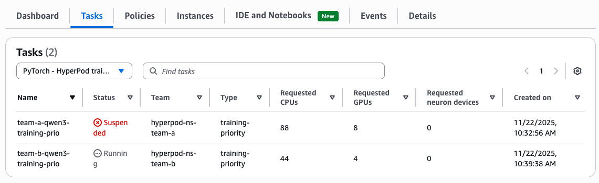

# Utilizing HyperPod Task Governance - HyperPod CLI End-to-End Walkthrough

SageMaker HyperPod task governance is a management system designed to streamline resource allocation and ensure efficient utilization of compute resources across teams and projects for your Amazon EKS clusters, providing administrators with the capability to set priority levels for various tasks, compute allocation for each team, how each team lends and borrows idle compute, and if a team preempts their own tasks.

This section will guide you through an end to end example of using task governance. For this example, we use a cluster of at least 2 `ml.g5.12xlarge` instances split by two teams. This assumes that you completed the setup instructions in [00-getting-started/00-setup.md](../00-getting-started/00-setup.md) and the training dataset and docker image creation instructions in [01-training-job-submission/00-pytorch-training-job.md](../01-training-job-submission/00-pytorch-training-job.md).

Please setup the following environment variables corresponding to your account. `S3_BUCKET_NAME` should be the bucket corresponding to your FSx filesystem, which contains the training data and scripts, as described in [01-training-job-submission/00-pytorch-training-job.md](../01-training-job-submission/00-pytorch-training-job.md).
```bash
AWS_REGION="PLEASE_FILL_IN"
AWS_ACCOUNT_ID="PLEASE_FILL_IN"
S3_BUCKET_NAME="PLEASE_FILL_IN"

DOCKER_IMAGE_TAG="pytorch2.8-cu129"
ECR_NAME="qwen3-finetuning"
S3_PREFIX="qwen-cli-example"
```
## Borrowing idle compute from other teams (💻)

**Scenario**: Team A submits a training job that **requires 2 instances** (8 GPUs) but only has **1 instance allocated**. Hyperpod task governance allows Team A to **borrow 1 instance** from Team B's idle capacity because we have allowed Borrowing and Lending when setting up the team quotas in [00-getting-started/00-setup.md](../00-getting-started/00-setup.md).

The following command submits the 2 instance, 8 GPU job to the namespace and task queue of Team A:
```
JOB_NAME=team-a-qwen3-training-prio
TEAM_NAMESPACE=hyperpod-ns-team-a
TEAM_QUEUE=$TEAM_NAMESPACE-localqueue
TEAM_FSX_CLAIM=fsx-pvc-hyperpod-ns-team-a
JOB_PRIO=training-priority

hyp create hyp-pytorch-job \
    --job-name $JOB_NAME \
    --namespace $TEAM_NAMESPACE \
    --queue-name $TEAM_QUEUE \
    --priority $JOB_PRIO \
    --image $AWS_ACCOUNT_ID.dkr.ecr.$AWS_REGION.amazonaws.com/$ECR_NAME:$DOCKER_IMAGE_TAG \
    --command "[hyperpodrun, --nnodes=2:2, --nproc_per_node=4, /data/$S3_PREFIX/scripts/train.py]" \
    --args "[--config, /data/$S3_PREFIX/scripts/args.yaml]" \
    --environment '{"LOGLEVEL": "INFO", "PYTORCH_CUDA_ALLOC_CONF": "expandable_segments:True", "NCCL_DEBUG": "INFO", "NCCL_SOCKET_IFNAME": "^lo", "TORCH_NCCL_ASYNC_ERROR_HANDLING": "1", "FI_PROVIDER": "efa", "FI_EFA_FORK_SAFE": "1", "NCCL_PROTO": "simple"}' \
    --pull-policy "IfNotPresent" \
    --instance-type ml.g5.12xlarge \
    --node-count 2 \
    --tasks-per-node 4 \
    --deep-health-check-passed-nodes-only false \
    --max-retry 100 \
    --volume name=shmem,type=hostPath,mount_path=/dev/shm,path=/dev/shm,read_only=false \
    --volume name=local,type=hostPath,mount_path=/local,path=/mnt/k8s-disks/0,read_only=false \
    --volume name=fsx-volume,type=pvc,mount_path=/data,claim_name=$TEAM_FSX_CLAIM,read_only=false
```

After the job got submitted successfully, you can list the jobs currently running on the cluster in the team's namespace and monitor their status 
using the following command:
```bash
hyp list hyp-pytorch-job -n $TEAM_NAMESPACE
```

Describe the job details by running:
```bash
hyp describe hyp-pytorch-job --job-name $JOB_NAME -n $TEAM_NAMESPACE
```

You can verify that the job is currently borrowing compute by running the following to show the status
of Team A`s `clusterqueue`:
```bash
kubectl get clusterqueue hyperpod-ns-team-a-clusterqueue -o jsonpath='{.status.flavorsUsage[0]}'
```

The output will look similar to the following, showing that the job is borrowing cpu, memory and gpu of Team B:
```json
{
  "name": "ml.g5.12xlarge",
  "resources": [
    {
      "borrowed": "0",
      "name": "aws.amazon.com/neurondevice",
      "total": "0"
    },
    {
      "borrowed": "40",
      "name": "cpu",
      "total": "88"
    },
    {
      "borrowed": "136Gi",
      "name": "memory",
      "total": "328Gi"
    },
    {
      "borrowed": "4",
      "name": "nvidia.com/gpu",
      "total": "8"
    },
    {
      "borrowed": "0",
      "name": "vpc.amazonaws.com/efa",
      "total": "0"
    }
  ]
}
```

## Reclaiming guaranteed compute (💻)

**Scenario**: Team B needs to reclaim its compute resources. By submitting a job requiring **1 instance**, Team B's job is **prioritized** as one of the instances currently used belongs to Team B, and Job 1 is **suspended** due to resource unavailability.

The following command submits the 1 instance, 4 GPU job to the namespace and task queue of Team B:
```
JOB_NAME=team-b-qwen3-training-prio
TEAM_NAMESPACE=hyperpod-ns-team-b
TEAM_QUEUE=$TEAM_NAMESPACE-localqueue
TEAM_FSX_CLAIM=fsx-pvc-hyperpod-ns-team-b
JOB_PRIO=training-priority

hyp create hyp-pytorch-job \
    --job-name $JOB_NAME \
    --namespace $TEAM_NAMESPACE \
    --queue-name $TEAM_QUEUE \
    --priority $JOB_PRIO \
    --image $AWS_ACCOUNT_ID.dkr.ecr.$AWS_REGION.amazonaws.com/$ECR_NAME:$DOCKER_IMAGE_TAG \
    --command "[hyperpodrun, --nnodes=2:2, --nproc_per_node=4, /data/$S3_PREFIX/scripts/train.py]" \
    --args "[--config, /data/$S3_PREFIX/scripts/args.yaml]" \
    --environment '{"LOGLEVEL": "INFO", "PYTORCH_CUDA_ALLOC_CONF": "expandable_segments:True", "NCCL_DEBUG": "INFO", "NCCL_SOCKET_IFNAME": "^lo", "TORCH_NCCL_ASYNC_ERROR_HANDLING": "1", "FI_PROVIDER": "efa", "FI_EFA_FORK_SAFE": "1", "NCCL_PROTO": "simple"}' \
    --pull-policy "IfNotPresent" \
    --instance-type ml.g5.12xlarge \
    --node-count 1 \
    --tasks-per-node 4 \
    --deep-health-check-passed-nodes-only false \
    --max-retry 100 \
    --volume name=shmem,type=hostPath,mount_path=/dev/shm,path=/dev/shm,read_only=false \
    --volume name=local,type=hostPath,mount_path=/local,path=/mnt/k8s-disks/0,read_only=false \
    --volume name=fsx-volume,type=pvc,mount_path=/data,claim_name=$TEAM_FSX_CLAIM,read_only=false
```

After the job got submitted successfully, you can list the jobs currently running on the cluster in the team's namespace and monitor their status 
using the following command:
```bash
hyp list hyp-pytorch-job -n hyperpod-ns-team-a
hyp list hyp-pytorch-job -n hyperpod-ns-team-b
```

This will show you that Team A's job was suspended, and Team B's job is now running:
```

NAME                          NAMESPACE           STATUS         AGE            
--------------------------------------------------------------------------------
team-a-qwen3-training-prio    hyperpod-ns-team-a  Suspended      N/A            

NAME                          NAMESPACE           STATUS         AGE            
--------------------------------------------------------------------------------
team-b-qwen3-training-prio    hyperpod-ns-team-b  Running        2m             
```

Describe the job details by running:
```bash
hyp describe hyp-pytorch-job --job-name $JOB_NAME -n $TEAM_NAMESPACE
```

You can additionally see the task status in the AWS console UI by navigating to your HyperPod cluster
and viewing the **Tasks** tab and selecting **Pytorch - HyperPod Training Operator** in the dropdown menu:


## Preempt a lower priority task (💻)

Finally, the following example will show preemption by a higher priority task.

**Scenario**: Team B needs to deploy another training job with higher priority for a paper deadline. For this, the team submits a training job requiring **2 instances** with **experimentation priority** which is a higher priority level than the currently running job's **training priority** as configured in [00-getting-started/00-setup.md](../00-getting-started/00-setup.md). Team B's running training job is thus **suspended** to allow the experimentation job to utilize the resources.

The following command submits the 1 instance, 4 GPU job to the namespace and task queue of Team B:
```
JOB_NAME=team-b-qwen3-experimentation-prio
TEAM_NAMESPACE=hyperpod-ns-team-b
TEAM_QUEUE=$TEAM_NAMESPACE-localqueue
TEAM_FSX_CLAIM=fsx-pvc-hyperpod-ns-team-b
JOB_PRIO=experimentation-priority

hyp create hyp-pytorch-job \
    --job-name $JOB_NAME \
    --namespace $TEAM_NAMESPACE \
    --queue-name $TEAM_QUEUE \
    --priority $JOB_PRIO \
    --image $AWS_ACCOUNT_ID.dkr.ecr.$AWS_REGION.amazonaws.com/$ECR_NAME:$DOCKER_IMAGE_TAG \
    --command "[hyperpodrun, --nnodes=2:2, --nproc_per_node=4, /data/$S3_PREFIX/scripts/train.py]" \
    --args "[--config, /data/$S3_PREFIX/scripts/args.yaml]" \
    --environment '{"LOGLEVEL": "INFO", "PYTORCH_CUDA_ALLOC_CONF": "expandable_segments:True", "NCCL_DEBUG": "INFO", "NCCL_SOCKET_IFNAME": "^lo", "TORCH_NCCL_ASYNC_ERROR_HANDLING": "1", "FI_PROVIDER": "efa", "FI_EFA_FORK_SAFE": "1", "NCCL_PROTO": "simple"}' \
    --pull-policy "IfNotPresent" \
    --instance-type ml.g5.12xlarge \
    --node-count 2 \
    --tasks-per-node 4 \
    --deep-health-check-passed-nodes-only false \
    --max-retry 100 \
    --volume name=shmem,type=hostPath,mount_path=/dev/shm,path=/dev/shm,read_only=false \
    --volume name=local,type=hostPath,mount_path=/local,path=/mnt/k8s-disks/0,read_only=false \
    --volume name=fsx-volume,type=pvc,mount_path=/data,claim_name=$TEAM_FSX_CLAIM,read_only=false
```

After the job got submitted successfully, you can list the jobs currently running on the cluster in the team's namespace and monitor their status 
using the following command:
```bash
hyp list hyp-pytorch-job -n hyperpod-ns-team-a
hyp list hyp-pytorch-job -n hyperpod-ns-team-b
```

This will show you that Team B's initial job was suspended, and Team B's experimentation job is now running. Team A's job stays suspended:
```

NAME                          NAMESPACE           STATUS         AGE            
--------------------------------------------------------------------------------
team-a-qwen3-training-prio    hyperpod-ns-team-a  Suspended      N/A            

NAME                          NAMESPACE           STATUS         AGE            
--------------------------------------------------------------------------------
team-b-qwen3-exp-prio         hyperpod-ns-team-b  Running        2m             
team-b-qwen3-training-prio    hyperpod-ns-team-b  Suspended      N/A   
```

Finally, delete all the submitted jobs to free up the resources:
```
hyp delete hyp-pytorch-job --job-name team-a-qwen3-training-prio -n hyperpod-ns-team-a
hyp delete hyp-pytorch-job --job-name team-b-qwen3-training-prio -n hyperpod-ns-team-b
hyp delete hyp-pytorch-job --job-name team-b-qwen3-experimentation-prio -n hyperpod-ns-team-b
```