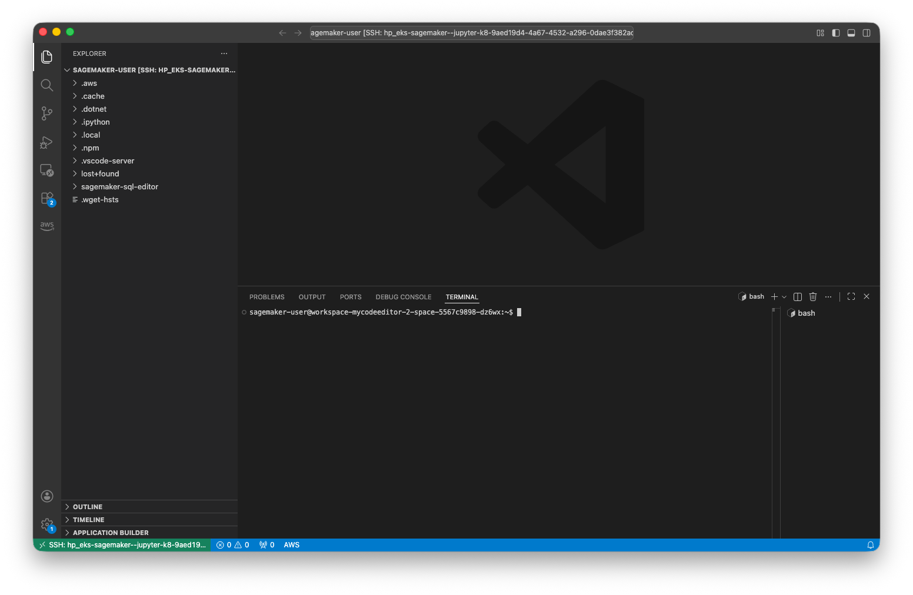
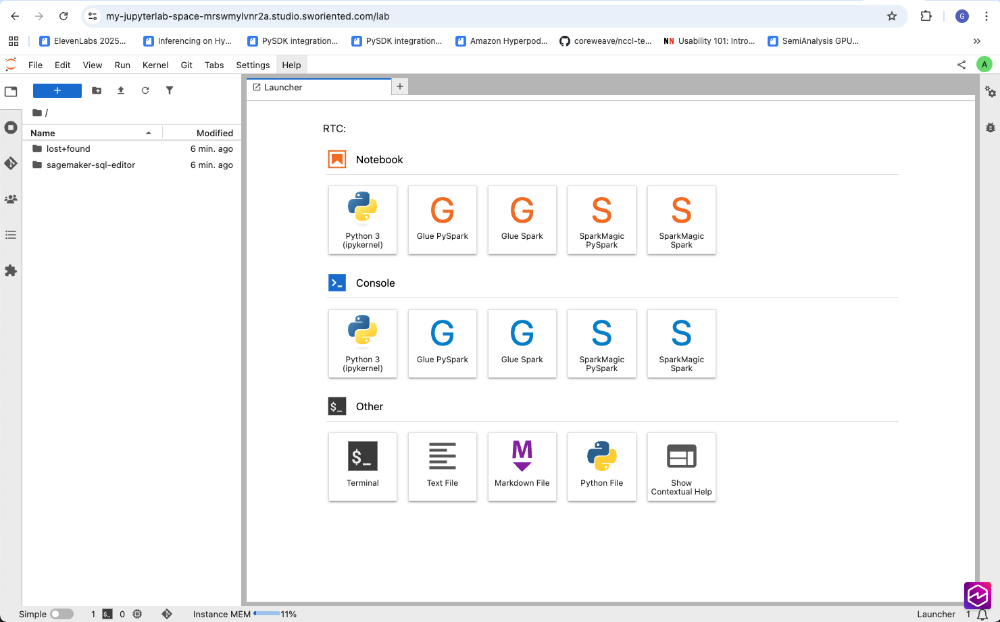

# SageMaker Spaces for IDEs and Notebooks - HyperPod CLI End-to-End Walkthrough

SageMaker Spaces is a functionality which allows AI developers to run their interactive machine learning workloads directly on HyperPod EKS clusters through IDEs and notebooks.

Spaces can be created and managed using the HyperPod CLI. In this example you will create a space and connect your Visual Studio Code IDE to it. Then, we'll access the space through the web UI.

This example assumes that you completed the setup instructions in [00-getting-started/00-setup.md](../00-getting-started/00-setup.md).

Define a name for the new space.

```bash
SPACE_NAME=my-jupyterlab-space
```

Create the space on a CPU instance and mount your FSx for Lustre Filesystem to it by executing the following command:
```bash
hyp create hyp-space --name $SPACE_NAME \
--display-name $SPACE_NAME --node-selector '{"node.kubernetes.io/instance-type":"ml.t3.2xlarge"}' \
--volume name=fsx-data,mountPath=/fsx,persistentVolumeClaimName=fsx-claim
```

If successful, this will show the following output:
```
Space 'my-jupyterlab-space' created successfully in namespace 'default'
```

You can list the spaces in your HyperPod cluster by running the following command:
```bash
hyp list hyp-space 
```

This will show your newly created space. After a few minutes, the `AVAILABLE` status will change to `True`:
```
NAME                NAMESPACE    AVAILABLE    PROGRESSING    DEGRADED
------------------  -----------  -----------  -------------  ----------
my-jupyterlab-space  default      True         False          False
```

You can show your space's configuration by running the following command.
```bash
hyp describe hyp-space --name $SPACE_NAME
```

This will show a configuration similar to the following:
```
apiVersion: workspace.jupyter.org/v1alpha1
kind: Workspace
metadata:
  annotations:
    workspace.jupyter.org/created-by: ****
    workspace.jupyter.org/last-updated-by: system:serviceaccount:jupyter-k8s-system:jupyter-k8s-controller-manager
  creationTimestamp: '2025-11-24T18:43:53Z'
  finalizers:
  - workspace.jupyter.org/workspace-protection
  generation: 1
  labels:
    workspace.jupyter.org/access-strategy-name: hyperpod-access-strategy
    workspace.jupyter.org/access-strategy-namespace: jupyter-k8s-system
    workspace.jupyter.org/template-name: sagemaker-jupyter-template
    workspace.jupyter.org/template-namespace: default
  name: my-jupyterlab-space
  namespace: default
  resourceVersion: '353398'
  uid: 68ad0a20-8eb1-4c2f-81fd-cf0590bbb743
spec:
  accessStrategy:
    name: hyperpod-access-strategy
    namespace: jupyter-k8s-system
  accessType: Public
  appType: jupyterlab
  containerConfig:
    command:
    - /opt/amazon/sagemaker/workspace/bin/entrypoint-workspace-jupyterlab
  displayName: my-jupyterlab-space
  image: public.ecr.aws/sagemaker/sagemaker-distribution:latest-cpu
  nodeSelector:
    node.kubernetes.io/instance-type: ml.t3.2xlarge
  ownershipType: Public
  podSecurityContext:
    fsGroup: 1000
  resources:
    limits:
      cpu: '2'
      memory: 8Gi
    requests:
      cpu: '2'
      memory: 8Gi
  serviceAccountName: default
  storage:
    mountPath: /home/sagemaker-user
    size: 5Gi
    storageClassName: sagemaker-spaces-default-storage-class
  templateRef:
    name: sagemaker-jupyter-template
  volumes:
  - mountPath: /fsx
    name: fsx-data
    persistentVolumeClaimName: fsx-claim
status:
  accessResourceSelector: workspace.jupyter.org/workspace-name=my-jupyterlab-space
  accessResources:
  - apiVersion: traefik.io/v1alpha1
    kind: IngressRoute
    name: authorized-route-my-jupyterlab-space
    namespace: default
  - apiVersion: traefik.io/v1alpha1
    kind: IngressRoute
    name: unauthorized-route-my-jupyterlab-space
    namespace: default
  conditions:
  - lastTransitionTime: '2025-11-24T18:44:06Z'
    message: Workspace is ready
    reason: ResourcesReady
    status: 'True'
    type: Available
  - lastTransitionTime: '2025-11-24T18:44:06Z'
    message: Workspace is ready
    reason: ResourcesReady
    status: 'False'
    type: Progressing
  - lastTransitionTime: '2025-11-24T18:44:06Z'
    message: No errors detected
    reason: NoError
    status: 'False'
    type: Degraded
  - lastTransitionTime: '2025-11-24T18:44:06Z'
    message: Workspace is running
    reason: DesiredStateRunning
    status: 'False'
    type: Stopped
  deploymentName: workspace-my-jupyterlab-space
  serviceName: workspace-my-jupyterlab-space-service

```

Let's connect your VSCode IDE to your newly created space, run the following command:
```bash
hyp create hyp-space-access --name $SPACE_NAME --connection-type vscode-remote
```

This will print a `JSON`-formatted output to the console that contains a `SpaceConnectionUrl`. Copy this URL to your browser and allow it to open VSCode. This will establish an SSH connection to VSCode server in your HyperPod space. You can now use the space and interactively run workloads on your HyperPod cluster through this IDE.



Lastly let's generate a JupyterLab web UI URL (if the web ui has been enabled in your environment):
```bash
hyp create hyp-space-access --name $SPACE_NAME --connection-type web-ui
```

This will print a JSON-formatted output to the console that contains a SpaceConnectionUrl. Copy this URL to your browser (or click on it) to open JupyterLab. 

